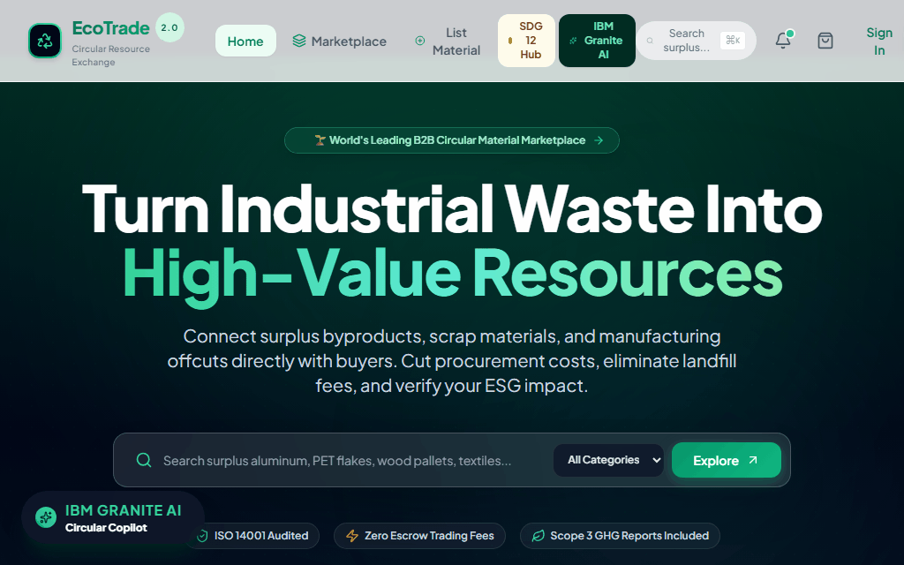

# 🎬 EcoTrade 2.0 — Project Working Overview & Demo

> **1M1B AI for Sustainability Virtual Internship**  
> *In Collaboration with **IBM SkillsBuild** & **AICTE***  
> **Theme**: AI-Driven B2B Circular Economy Exchange & Scope 3 Carbon Accounting

---

## 📽️ Live Working Demonstration Walkthrough

  

---

## 🧭 Walkthrough Flow & Features Demonstrated

1. **Enterprise Hero Dashboard**: Real-time Scope 3 avoided $\text{CO}_2\text{e}$ metrics and landfill tonnage diversion counters.
2. **Surplus Marketplace**: Dynamic filtering across 6 industrial secondary materials (*Plastics/rPET, 6061 Aluminum, Timber, Flint Glass, E-Waste, Textiles*).
3. **1M1B & IBM SkillsBuild SDG 12 Hub**: 5-Stage Design Thinking Roadmap (*Empathize $\rightarrow$ Define $\rightarrow$ Ideate $\rightarrow$ Prototype $\rightarrow$ Test*) and Responsible AI governance matrix.
4. **IBM Granite AI Circular Copilot**: Live conversational prompt answering Scope 3 greenhouse gas avoidance calculations and UN SDG 12.5 targets.
5. **watsonx.ai In-App Credentials Drawer**: Live model selector (`ibm/granite-3-8b-instruct`, `ibm/granite-13b-chat-v2`) and IBM Cloud API key management.
6. **Live IBM Granite AI Material Assay**: On-demand AI chemical purity estimation and Scope 3 avoided carbon certification on individual material lots.
