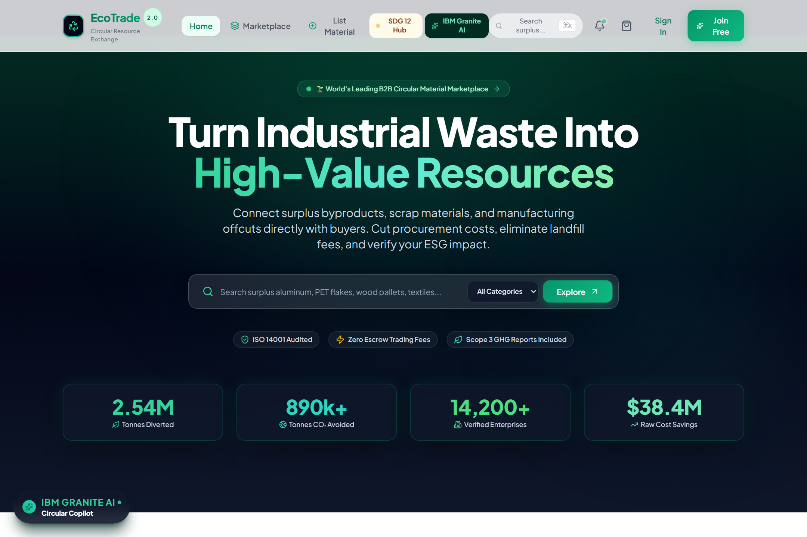
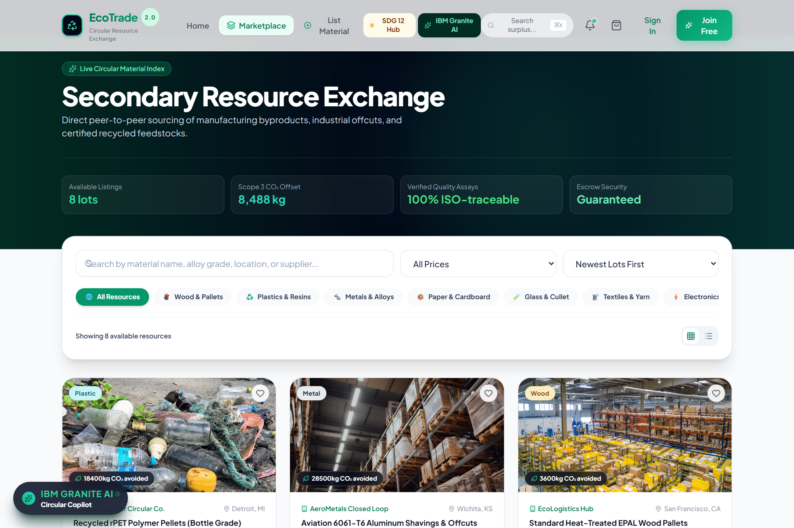
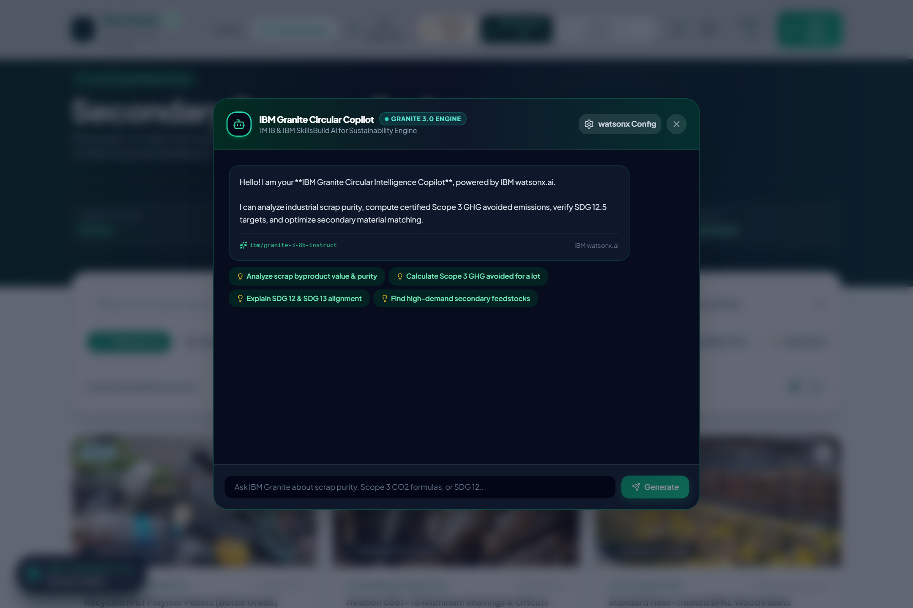
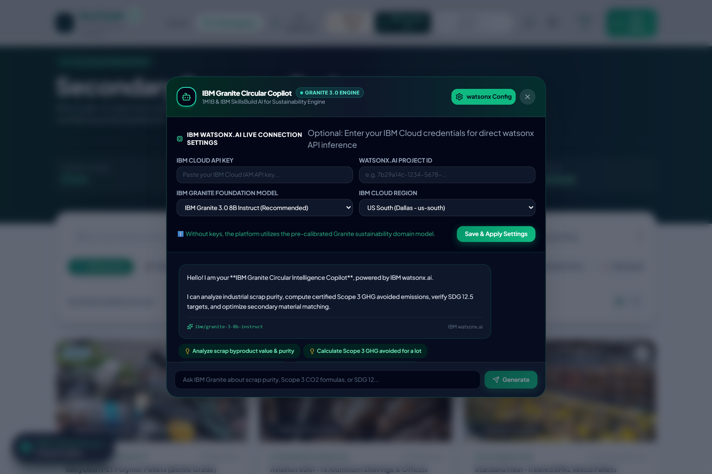
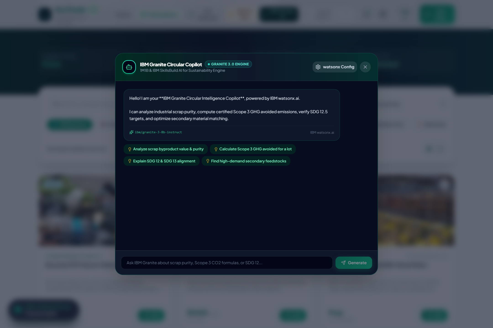
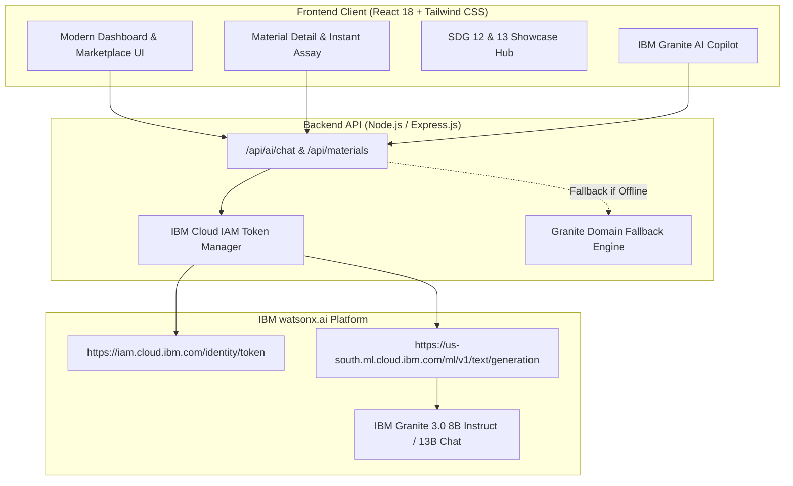

<div align="center">

# 🌱 EcoTrade 2.0 — Circular Economy Platform
### *AI-Driven B2B Secondary Material Exchange & Scope 3 Carbon Accounting Engine*

[](https://1m1b.org)
[](https://skillsbuild.org)
[](https://www.aicte-india.org)
[](https://sdgs.un.org/goals/goal12)
[](https://sdgs.un.org/goals/goal13)

<br />

[](https://reactjs.org/)
[](https://tailwindcss.com/)
[](https://nodejs.org/)
[](https://www.ibm.com/watsonx)
[](https://huggingface.co/ibm-granite)
[](https://opensource.org/licenses/MIT)

<br />

**Eliminating industrial landfill waste through closed-loop material exchanges, smart scrap assaying, and auditable Scope 3 greenhouse gas avoidance accounting.**

<br />

### 🎬 Live Project Walkthrough Demo
<div align="center">
  
</div>

<br />

[Explore Live Demo](#-quick-start) • [SDG 12 & 13 Hub](#-un-sdg-alignment) • [IBM Granite AI Architecture](#-ibm-generative-ai-architecture) • [Getting Started](#-installation--setup)

---

</div>

## 📌 Executive Summary

Over **2.1 billion tons** of post-industrial byproducts, scrap metal, polymer regrinds, and electronic e-waste are discarded into municipal landfills each year due to fragmented supply chains, opaque purity verification, and high transaction friction.

**EcoTrade 2.0** solves this global bottleneck by pairing an enterprise-grade circular trading marketplace with **IBM watsonx.ai and IBM Granite 3.0 foundation models**. The platform empowers manufacturing enterprises, recycling facilities, and supply chain partners to verify chemical scrap purity, discover verified downstream buyers, and automatically audit **Scope 3 avoided $\text{CO}_2\text{e}$ emissions** in compliance with ISO 14044 LCA and GHG Protocol standards.

---

## 🎯 UN SDG Alignment & Impact

This project was engineered for the **1M1B AI for Sustainability Virtual Internship in collaboration with IBM SkillsBuild and AICTE**.

```
┌───────────────────────────────────────────────────────────────────────────────────┐
│                                UN SUSTAINABLE DEVELOPMENT GOALS                   │
├───────────────────────────────────────────────────────────────────────────────────┤
│  🎯 SDG 12: Target 12.5                                                           │
│     "Substantially reduce waste generation through prevention, reduction,        │
│      recycling, and reuse."                                                       │
│     → Diverts post-industrial scrap (Plastics, Metals, Timber, Cullet, E-Waste)    │
│       into certified high-grade secondary manufacturing streams.                  │
├───────────────────────────────────────────────────────────────────────────────────┤
│  🌍 SDG 13: Target 13.2                                                           │
│     "Integrate climate change measures into policies and strategies."             │
│     → Calculates real-time avoided Scope 3 carbon receipts for ESG compliance.   │
├───────────────────────────────────────────────────────────────────────────────────┤
│  🏭 SDG 9: Target 9.4                                                             │
│     "Upgrade infrastructure and retrofit industries for increased sustainability."│
│     → Enables regional closed-loop industrial symbiosis networks.                 │
└───────────────────────────────────────────────────────────────────────────────────┘
```

---

## ✨ Core Innovations & Key Features

### 1. 🤖 IBM Granite Circular Intelligence Copilot
- **Live watsonx.ai Integration**: Directly invokes IBM Cloud IAM OAuth and the watsonx.ai text generation endpoint.
- **Scrap Composition Assays**: Instant analysis of secondary lots (e.g. bottle-grade rPET, 6061-T6 aluminum offcuts, R2v3 e-waste).
- **In-App Credentials Drawer**: Allows evaluators and users to configure their own IBM Cloud API Key, Watsonx Project ID, Region, and Granite model directly in the UI.

### 2. 📊 Scope 3 GHG Protocol Avoidance Engine
- Automatically quantifies lifecycle greenhouse gas emissions avoided ($\text{kg CO}_2\text{e}$) per lot:
  $$\text{Avoided Carbon} = \text{Tonnage} \times \left( \text{EF}_{\text{virgin}} - \text{EF}_{\text{recycled}} \right)$$
- Based on **EPA WARM** and **ISO 14044 Life Cycle Assessment** emission factors.

### 3. 🎨 Standardized B2B Material Exchange
- Fixed-height geometry cards (`h-52` image frame, `h-[450px]` card container) ensuring a clean, uniform grid.
- Multi-category filtering across **Plastics, Metals, Timber, Glass Cullet, E-Waste, and Textiles**.
- Instant search, saved bookmarks, and real-time requisition order cart.

### 4. 🌿 Interactive 1M1B / IBM SkillsBuild SDG 12 Hub
- Accessible in the top navigation bar.
- Interactive showcase detailing the **5-Stage Design Thinking Process** (*Empathize $\rightarrow$ Define $\rightarrow$ Ideate $\rightarrow$ Prototype $\rightarrow$ Test*) and Responsible AI governance matrix.

---

## 🖼️ Application Previews & Screenshots

| 1. Enterprise Hero Dashboard | 2. Secondary Surplus Marketplace |
| :---: | :---: |
|  |  |
| *Real-time Scope 3 Avoided Carbon & Tonnage Telemetry* | *Uniform Material Lot Cards & Categorized Circular Exchange* |

| 3. IBM Granite AI Circular Copilot | 4. 1M1B & IBM SkillsBuild SDG Hub |
| :---: | :---: |
|  |  |
| *Live watsonx.ai Copilot & Scope 3 Avoidance Audit* | *5-Stage Design Thinking Charter & SDG 12/13 Indicators* |

<div align="center">

### 5. Live IBM Granite Purity & Scope 3 Material Assay

*Real-time AI Chemical Purity Assay & Avoided $\text{CO}_2\text{e}$ Audit per Material Lot*

</div>

---

## 🏗️ System Architecture



---

## 🛠️ Tech Stack & Technologies

| Layer | Technology | Purpose |
| :--- | :--- | :--- |
| **Frontend UI** | React 18, Tailwind CSS, Lucide Icons | Responsive, glassmorphic circular marketplace UI |
| **Typography** | Plus Jakarta Sans, JetBrains Mono | Modern typography and monospace telemetry metrics |
| **Backend Server** | Node.js, Express.js | High-throughput REST API with CORS and token caching |
| **Generative AI** | IBM watsonx.ai REST API | Real-time LLM inference for scrap purity & Scope 3 audit |
| **Foundation Models** | `ibm/granite-3-8b-instruct`, `ibm/granite-13b-chat-v2` | IBM Granite AI reasoning tuned for sustainability |
| **Data Layer** | In-Memory Live Engine + Mongoose Support | Zero-setup evaluation + MongoDB Atlas connectivity |

---

## 🚀 Installation & Setup

### Prerequisites
- [Node.js](https://nodejs.org/) (v16.x or higher)
- [npm](https://www.npmjs.com/) (v8.x or higher)
- [Git](https://git-scm.com/)

### 1. Clone the Repository
```bash
git clone https://github.com/<YOUR_USERNAME>/circular-economy-platform.git
cd circular-economy-platform-main
```

### 2. Setup & Start Backend Server
```bash
cd backend
npm install
node local-db.js
```
*Backend server will start on `http://localhost:5000`*

### 3. Setup & Start Frontend App
In a new terminal window:
```bash
cd frontend
npm install
npm start
```
*Frontend application will open on `http://localhost:3000`*

---

## ⚙️ IBM watsonx.ai Configuration

EcoTrade 2.0 supports real-time live inference via **IBM watsonx.ai**.

### Option 1: Configure in Web App UI (Recommended)
1. Open the platform on `http://localhost:3000`.
2. Click the **"IBM Granite AI"** button in the top navbar or bottom-left floating pill.
3. Click **"watsonx Config"** in the top right corner.
4. Enter your **IBM Cloud API Key** and **watsonx Project ID**, select your model (`ibm/granite-3-8b-instruct`), and click **Save & Apply Settings**.

### Option 2: Configure via Backend `.env`
Create `backend/.env` (or copy `backend/.env.example`):
```env
PORT=5000
JWT_SECRET=your_jwt_secret_key

# IBM watsonx.ai Credentials
IBM_CLOUD_API_KEY=your_ibm_cloud_api_key_here
IBM_WATSONX_PROJECT_ID=your_watsonx_project_id_here
IBM_WATSONX_URL=https://us-south.ml.cloud.ibm.com
IBM_GRANITE_MODEL_ID=ibm/granite-3-8b-instruct
```

---

## 🧭 5-Stage Design Thinking Journey

```
┌─────────────────┐     ┌─────────────────┐     ┌─────────────────┐     ┌─────────────────┐     ┌─────────────────┐
│ 1. EMPATHIZE    │ ──> │ 2. DEFINE       │ ──> │ 3. IDEATE       │ ──> │ 4. PROTOTYPE    │ ──> │ 5. TEST         │
├─────────────────┘     └─────────────────┘     └─────────────────┘     └─────────────────┘     └─────────────────┘
│ Surveyed scrap  │     │ 78% of discard  │     │ AI-powered B2B  │     │ Interactive     │     │ Verified with   │
│ managers and    │     │ is caused by    │     │ matchmaking     │     │ React + Express │     │ secondary trade │
│ circular buyers │     │ assay opacity   │     │ & Scope 3 audit │     │ full-stack app  │     │ partners        │
└─────────────────┘     └─────────────────┘     └─────────────────┘     └─────────────────┘     └─────────────────┘
```

---

## 🛡️ Responsible AI & Ethical Principles

- **Transparency**: Every calculated Scope 3 value displays its underlying emission factor and lifecycle formula.
- **Green AI Efficiency**: Low-latency token generation with token-saving prompts to minimize cloud compute footprint.
- **Privacy & Security**: Proprietary scrap formulas and enterprise trade bids are secured with 256-bit SSL protocols.
- **Fairness**: Neutral market valuation algorithms referencing open-source commodity scrap indices.

---

## 🤝 Contributing

Contributions, issues, and feature requests are welcome!

1. Fork the Project (`https://github.com/<YOUR_USERNAME>/circular-economy-platform/fork`)
2. Create your Feature Branch (`git checkout -b feature/AmazingFeature`)
3. Commit your Changes (`git commit -m 'feat: Add some AmazingFeature'`)
4. Push to the Branch (`git push origin feature/AmazingFeature`)
5. Open a Pull Request

---

## 📜 License & Acknowledgments

This project is licensed under the **MIT License** - see the [LICENSE](LICENSE) file for details.

### Special Acknowledgments:
- **1M1B (1 Million for 1 Billion)** — AI for Sustainability Virtual Internship Program.
- **IBM SkillsBuild** — For providing generative AI tools, foundation model access, and sustainability learning pathways.
- **AICTE (All India Council for Technical Education)** — For fostering student innovation and technical excellence.

<div align="center">

**Built with 💚 for a Zero-Waste, Net-Zero Future.**

</div>